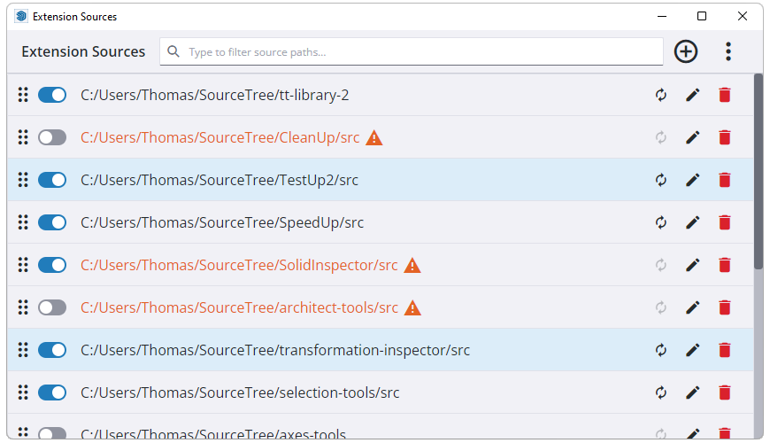
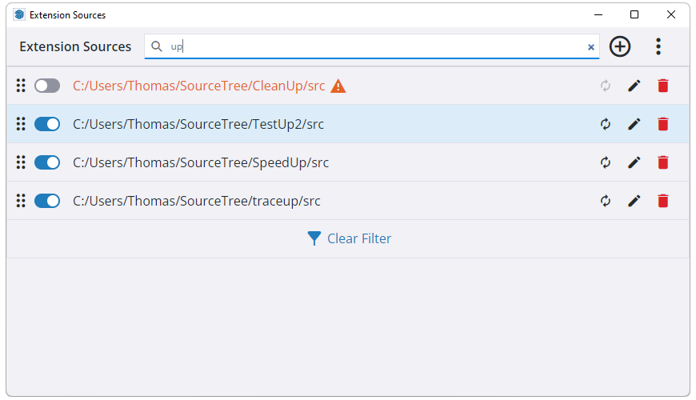
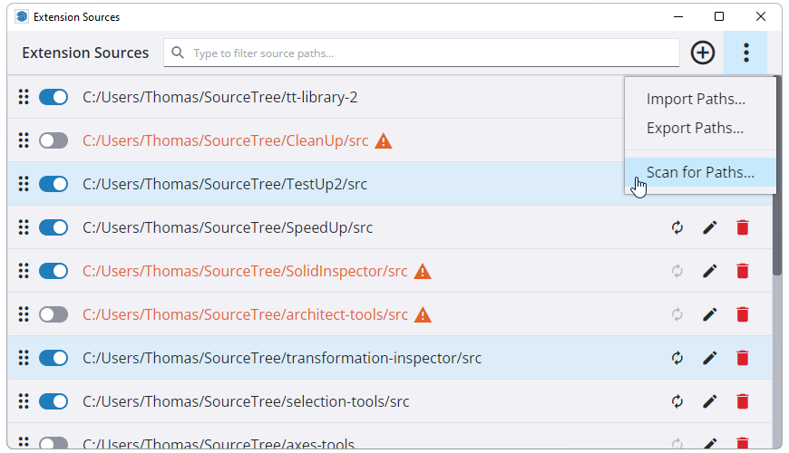
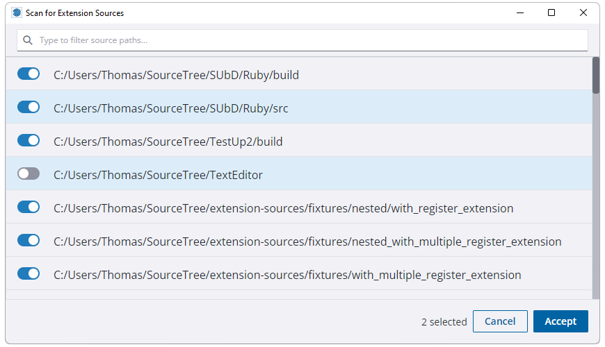

# Extension Sources

[](https://ci.appveyor.com/project/thomthom/extension-sources/branch/main)

Developer tool for managing additional sources to load SketchUp extensions from.

## How to Use

### Extension Sources Dialog

Add the path to where your extension source is located from the Extension Sources
dialog.



These paths are added to SketchUp's Ruby `$LOAD_PATH`.

Paths can be managed from within this dialog. Toggling the path will control
whether the sources will be loaded or not. The order of which the sources are
added to the `$LOAD_PATH` can also be rearranged by dragging and dropping the
selected items in the list.

The paths are shared among all installations of SketchUp where Extension Sources
is installed.

If you have a lot of sources they can be quickly filtered by using the quick filter textbox.



### Extension Sources Scanner Dialog

To quickly add multiple sources Extension Sources can scan and analyze a given
directory's sub-directories and look for the signature of extension sources.
It will look for Ruby files with `Sketchup.register_extension` accompanied by
a support folder of matching name.

The scan might take a few seconds or minutes, depending on your file system and
harddrive speed.



`Extension Sources Dialog` › `More…` (`⋮`) › `Scan for Paths…`



From the scan results the desired sources can be selected. The toggle switch will control
whether the source path will be loaded or not.

Note that paths already added to Extension Sources will not appear in the scan
results list.

## Compatibility

* SketchUp 2017 and newer
* Windows, macOS

## Known Issues

### Drag and drop irregularities

In SketchUp 2017 - SketchUp 2022.0 the HTML Drag and Drop API isn't fully
working. In these versions workarounds has been applied which will exhibit some
deviance from the normal drag and drop behaviour. For instance, it's not possible
to cancel a drag and drop by pressing ESC. The drag and drop cursor might also
not reflect it's correct state. This is fixed in SketchUp 2022.1.

### Drag and drop target indicator

In SketchUp 2017 to SketchUp 2020 there is no visual indicator to exactly where
the item will be dropped. This is due to limitation (bug?) in these SketchUp
versions.

## Tests

```sh
bundle exec rake test
```

```sh
bundle exec rake test TEST=tests/standalone/model/extension_source_test.rb
```

```sh
bundle exec rake test TEST=tests/standalone/model/extension_source_test.rb TESTOPTS="--name=/test_enabled.*/ -v"
```

```sh
bundle exec rake test TESTOPTS="--seed=64943"
```

## Documentation

### List undocumented code

```sh
bundle exec rake undoc
```

```sh
bundle exec yard stats --list-undoc
```

## Architecture

The following graph visualizes the hierarchy of the various components.
Higher levels can depend on lower levels, unless limited by an direct-only
dependency indicator (arrow).

`app` only deals with `controller` and `system`.

`controller` coordinates `view` and `model`.

`utils` can be used by anything.

Anything below the dashed line marked `SketchUp` can be use outside of SketchUp.
The unit tests between these two layers are separated.

```
┌─────────────────┐
│       app       │
└─────────────────┘
         ↑
┌─────────────────┐
│ ┌─────────────┐ │ ┌─────────────┐
│ │ controller  │ ← │    view     │
│ └─────────────┘ │ └─────────────┘
│ ┌─────────────┐ │
│ │   system    │ │
│ └─────────────┘ │
└─────────────────┘
┄┄┄┄┄┄┄┄┄┄┄┄┄┄┄┄┄┄┄┄ SketchUp
┌─────────────────┐
│      model      │
└─────────────────┘
╔═════════════════╗
║      utils      ║
╚═════════════════╝
```
